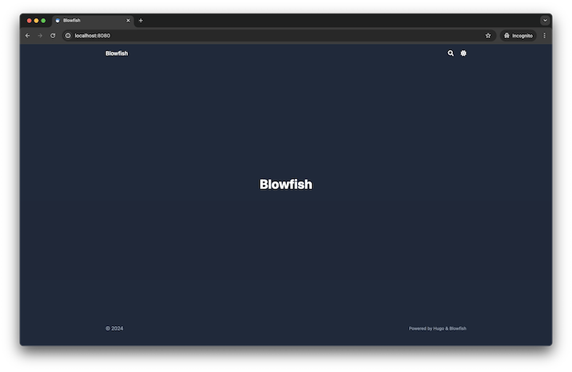
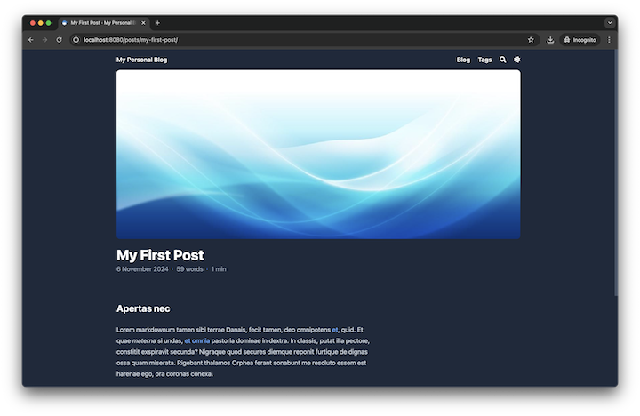

+++
title = "My Personal Blog Using Hugo and Blowfish"
date = 2024-11-06T18:50:00+07:00
draft = false
tags = ["hugo", "blowfish"]
slug = "my-personal-blog-using-hugo-and-blowfish"
+++

## What is [Hugo](https://gohugo.io/)?
Here’s an excerpt from the official Hugo documentation introduction.
> Hugo is a [static site generator](https://en.wikipedia.org/wiki/Static_site_generator) written in [Go](https://go.dev/), optimized for speed and designed for flexibility. With its advanced templating system and fast asset pipelines, Hugo renders a complete site in seconds, often less.

For a quick introduction, you can check out [Hugo in 100 Seconds](https://www.youtube.com/watch?v=0RKpf3rK57I) from [Fireship](https://www.youtube.com/@Fireship) too.


## Why Hugo?
Hugo offers a variety of powerful [features](https://gohugo.io/about/features/), including support for [multilingual](https://gohugo.io/content-management/multilingual/), [templates](https://gohugo.io/templates/introduction/), rich [content formats](https://gohugo.io/content-management/formats/), easy-to-use [shortcodes](https://gohugo.io/content-management/shortcodes/), and [image processing](https://gohugo.io/content-management/image-processing/).

Though I’m new to static site generators, I chose Hugo because of features like multilingual, and templates which use Go's [text/template](https://pkg.go.dev/text/template) and [html/template](https://pkg.go.dev/html/template) packages, making it a natural fit for me.

## What is [Blowfish](https://blowfish.page/)?
Blowfish is a theme designed for Hugo that includes support for [Tailwind CSS v3](https://tailwindcss.com/blog/tailwindcss-v3), automatic image resizing, integrated site search, and more. You can explore additional features in the [Blowfish documentation](https://blowfish.page/docs/welcome/).

## Setting Hugo on Local
### Prerequisites
To run Hugo locally, you’ll optionally need [Git](https://git-scm.com/book/en/v2/Getting-Started-Installing-Git), [Go](https://go.dev/doc/install), and [Dart Sass](https://gohugo.io/hugo-pipes/transpile-sass-to-css/#dart-sass) for specific use casese.
- Git is essential to use [Hugo Modules](https://gohugo.io/hugo-modules/), install a theme by using [Git Submodule](https://git-scm.com/book/en/v2/Git-Tools-Submodules), and use [GitHub Pages](https://pages.github.com/).
- Go is required to use the Hugo Modules.

### Installation
For the sake of simplicity, I recommend using [Homebrew](https://brew.sh/) for installing on Mac:
```bash
brew install hugo
```
If Homebrew is not installed yet, it can be set up using the following script:
```bash
/bin/bash -c "$(curl -fsSL https://raw.githubusercontent.com/Homebrew/install/HEAD/install.sh)"
```

### Setting Up
1. Create a new site named personal-blog using these commands:
    ```bash
    hugo new site personal-blog
    cd personal-blog
    hugo mod init github.com/pyaethu-aung/personal-blog
    hugo mod tidy
    ```
2. Download configuration files to complete the setup for Blowfish. Access the files from [this link](https://minhaskamal.github.io/DownGit/#/home?url=https://github.com/nunocoracao/blowfish/tree/main/config/_default) and copy them into the `/config/_default` directory.
3. Add following content to `config/_default/module.toml` file:
    ```bash
    [[imports]]
    disable = false
    path = "github.com/nunocoracao/blowfish/v2"
    ```
4. Start Hugo by running the command below. You can view the homepage by navigating to http://localhost:8080/ :
    ```bash
    hugo server --port 8080
    ```
    


### Configuration
#### 1. Update the following values in `/config/_default/languages.en.toml`:
```toml
title = "My Personal Blog"

[params.author]
  name = "My Name"
  email = "hello@myname.com"
  headline = "I'm writing blog by using Hugo and Blowfish"
  bio = "Freelance Developer"
  links = [
    { email = "mailto:hello@myname.com" },
    { github = "https://github.com/myname" }
  ]
```
You will notice the homepage content changes as shown below:


#### 2. Update the following values in `/config/_default/menus.en.toml`:
```toml
[[main]]
  name = "Blog"
  pageRef = "posts"
  weight = 10

[[main]]
  name = "Tags"
  pageRef = "tags"
  weight = 30
```
You will notice the homepage content changes as shown below:


#### 3. Update the following values in `/config/_default/params.toml`:
```toml
[homepage]
  layout = "hero"
  homepageImage = "images/hero_background.jpg" # hero_background.jpg should be in "/assets/images/"
  showRecent = true
  showMoreLink = true
  cardView = true
```
You will notice the homepage content changes as shown below:


## Add a New Post
1. Add a new post by running the command below:
    ```shell
    hugo new content content/posts/my-first-post/index.md
    ```

2. Update the [font matter](https://gohugo.io/content-management/front-matter/) in the generated `index.md` file as shown below, and use sample content from [Lorem Markdownum](https://jaspervdj.be/lorem-markdownum/):
    ```md
    +++
    title = "My First Post"
    date = 2024-11-06T10:10:00+00:00
    draft = false
    tags = ["hugo", "blowfish"]
    slug = "my-first-post"
    +++
    ```

3. Update the following values in `/config/_default/params.toml`:
    ```toml
    [article]
      showAuthor = true
    ```
    You will notice the homepage content changes as shown below:
    
    You will be able to see your post displayed as shown below:
    

4. To add a hero section to the post and display the author information at the bottom of the page, update the following values in `/config/_default/params.toml`. Additionally, place a hero image in the same directory as `index.md` with the filename `featured.jpeg`.
    ```toml
    [article]
      showAuthor = true
      showAuthorBottom = true
      showHero = true
      heroStyle = "big"
    ```
    You will notice the post changes as shown below:
    
    The post list item on the home screen will appear as shown below:
    

You can download the final project resulting from the steps above via [this link](/files/personal-blog.zip).

I’ll share how to deploy Hugo on GitHub Pages in my next post.