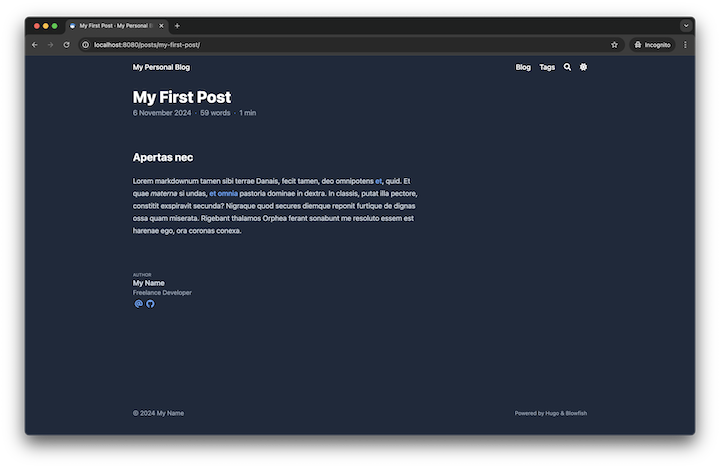

+++
title = "Hugo၊ Blowfish နဲ့ Personal Blog"
date = 2024-11-06T18:50:00+07:00
draft = false
tags = ["hugo", "blowfish"]
slug = "personal-blog-using-hugo-and-blowfish"
+++

[Read this article in English](/posts/my-personal-blog-using-hugo-and-blowfish)

## What is [Hugo](https://gohugo.io/)?
Hugo က ဘာလဲဆိုတဲ့ အကျဉ်းချုပ်ကို Hugo official documentation ထဲကနေပဲ အလွယ်တကူယူသုံးလိုက်ပါတယ်။
> Hugo is a [static site generator](https://en.wikipedia.org/wiki/Static_site_generator) written in [Go](https://go.dev/), optimized for speed and designed for flexibility. With its advanced templating system and fast asset pipelines, Hugo renders a complete site in seconds, often less.

Hugo ကို အခုမှစကြားဖူးတာဆိုရင် [Fireship](https://www.youtube.com/@Fireship) ရဲ့ [Hugo in 100 Seconds](https://www.youtube.com/watch?v=0RKpf3rK57I) video လေးကို အရင်ကြည့်စေချင်ပါတယ်။


## Why Hugo?
Hugo offers a variety of powerful [features](https://gohugo.io/about/features/), including support for [multilingual](https://gohugo.io/content-management/multilingual/), [templates](https://gohugo.io/templates/introduction/), rich [content formats](https://gohugo.io/content-management/formats/), easy-to-use [shortcodes](https://gohugo.io/content-management/shortcodes/), and [image processing](https://gohugo.io/content-management/image-processing/).

ကျွန်တော်အရင်က [Medium](https://medium.com/@pyaethuaung) မှာ article လေး နဲနဲပါးပါးရေးဖူးပေမယ့် blog ကို အခုမှစရေးဖြစ်တာ။ စရေးဖြစ်တဲ့အကြောင်းကလည်း ကိုယ်တွေ့ကြုံဖြေရှင်းခဲ့ဖူးတာတွေကို အချိန်နဲနဲကြာလာတာနဲ့ မမှတ်မိတော့တာကြောင့်ကအဓိကပါ။
Blog စလုပ်မယ်ဆိုတော့ SSG တွေကလည်း တခုမှမသုံးဖူးတာနဲ့ နည်းနည်းပါးပါးလိုက်ရှာပြီး Hugo ကိုပဲ သုံးဖြစ်လိုက်တယ်။ အဓိကက ကိုယ်က Go နဲ့ ပိုရင်းနီးတော့ Go's [text/template](https://pkg.go.dev/text/template) နဲ့ [html/template](https://pkg.go.dev/html/template) လိုမျိုးတွေ သုံးဖို့လိုလာရင် ပိုရင်းနီးတာကြောင့်ရယ်၊ မြန်မာလို ရော English လိုရောကို အဆင်ပြေပြေပြောင်းလို့ရတာတွေကြောင့်လို့ ပြောရမယ်။

## What is [Blowfish](https://blowfish.page/)?
Theme အတွက်က Blowfish ကို သုံးဖြစ်လိုက်တယ်။ Automatic image resizing၊ integrated site search နဲ့ documentation ကောင်းလို့ပါ။ Documentation အသေးစိတ်ကို [ဒီမှာ]((https://blowfish.page/docs/welcome/)) ကြည့်လို့ရတယ်။ သူက [Tailwind CSS v3](https://tailwindcss.com/blog/tailwindcss-v3) နဲ့။

## Setting Hugo on Local
### Prerequisites
Hugo ကို local မှာ run ဖို့ဆိုရင် [Git](https://git-scm.com/book/en/v2/Getting-Started-Installing-Git) နဲ့ [Go](https://go.dev/doc/install) လိုမယ်။ [Dart Sass](https://gohugo.io/hugo-pipes/transpile-sass-to-css/#dart-sass) ကတော့ သာမန် blog အတွက်မလိုပါဘူး။

Git ကို [Hugo Modules](https://gohugo.io/hugo-modules/) သုံးမယ်ဆိုရင်၊ theme ကို [Git Submodule](https://git-scm.com/book/en/v2/Git-Tools-Submodules) နဲ့ သွင်းမယ်ဆိုရင်နဲ့ blog ကို [GitHub Pages](https://pages.github.com/) ပေါ်မှာတင်မယ်ဆိုရင် မဖြစ်မနေလိုမယ်။

### Installation
Installation ကို [Homebrew](https://brew.sh/) နဲ့ပဲ လုပ်လိုက်တယ်။
```bash
brew install hugo
```
တကယ်လို့ Homebrew မရှိသေးရင် အောက်က script နဲ့ အရင် install လုပ်ဖို့လိုမယ်။
```bash
/bin/bash -c "$(curl -fsSL https://raw.githubusercontent.com/Homebrew/install/HEAD/install.sh)"
```

### Setting Up
1. အရင်ဆုံး Hugo project တခု set up လုပ်မယ်။ နာမည်ကတော့ `personal-blog` လို့ပဲပေးလိုက်မယ်။
    ```bash
    hugo new site personal-blog
    cd personal-blog
    hugo mod init github.com/pyaethu-aung/personal-blog
    hugo mod tidy
    ```
2. Theme အနေနဲ့ Blowfish ကို သုံးဖို့အတွက် configuration files တွေကို [ဒီ link](https://minhaskamal.github.io/DownGit/#/home?url=https://github.com/nunocoracao/blowfish/tree/main/config/_default) ကနေ လုပ်ပီး `/config/_default` directory ထဲမှာထည့်ပေးရမယ်။
3. ပြီးရင် Blowfish ကို Hugo module အနေနဲ့ သုံးဖို့အတွက် အောက်က configuration ကို `config/_default/module.toml` file မှာထည့်ပေး။
    ```bash
    [[imports]]
    disable = false
    path = "github.com/nunocoracao/blowfish/v2"
    ```
4. Theme လည်း set up လုပ်ပြီးပြီဆိုရင် အောက်က command နဲ့ [localhost 8080](http://localhost:8080/)  မှာ blog ကို ကြည့်လို့ရပြီ။
    ```bash
    hugo server --port 8080
    ```
    


### Configuration
1. `/config/_default/languages.en.toml` မှာ အောက်ကအတိုင်း blog ရဲ့ ခေါင်းစဉ်၊ ကိုယ့်နာမည်၊ email၊ GitHub link စတာတွေကို configure လုပ်ပေး။
    ```toml
    title = "My Personal Blog"

    [params.author]
      name = "My Name"
      email = "hello@myname.com"
      headline = "I'm writing blog by using Hugo and Blowfish"
      bio = "Freelance Developer"
      links = [
        { email = "mailto:hello@myname.com" },
        { github = "https://github.com/myname" }
      ]
    ```
    File ကို save လိုက်ရင် home page မှာ ကိုယ်ပြင်လိုက်တဲ့အတိုင်း hot reload နဲ့ မြင်ရမယ်။
    
2. Menu အတွက်က `/config/_default/menus.en.toml` မှာ posts နဲ့ tags configuration တွေကို uncomment လုပ်ပေးလိုက်ရုံပဲ။ Blowfish က post တင်တာနဲ့ အလိုလိုထည့်ပေးသွားပါလိမ့်မယ်။
    ```toml
    [[main]]
      name = "Blog"
      pageRef = "posts"
      weight = 10

    [[main]]
      name = "Tags"
      pageRef = "tags"
      weight = 30
    ```
    
3. ကျွန်တော်က home page ကို hero layout ထားချင်တာ။ ပြီးတော့ နောက်ဆုံးတင်ခဲ့တဲ့ post တွေကိုလည်း တခါတည်းမြင်ချင်တာဆိုတော့ `/config/_default/params.toml` မှာ အောက်က configuration အတိုင်း ပြောင်းလိုက်ပါတယ်။ ဒီမှာဆိုရင် `hero_background.jpg` file က `/assets/images/` ထဲမှာရှိနေဖို့တော့လိုမယ်။
    ```toml
    [homepage]
      layout = "hero"
      homepageImage = "images/hero_background.jpg"
      showRecent = true
      showMoreLink = true
      cardView = true
    ```
    

## Add a New Post
1. Markdown file နဲ့ post အသစ်တခု စလုပ်လိုက်မယ်။ Markdown မဟုတ်ပဲ HTML နဲ့ [Pandoc](https://gohugo.io/content-management/formats/#pandoc) လို format တွေနဲ့လည်းရတယ်။ [ဒီ link](https://gohugo.io/content-management/formats) မှာ အသေးစိတ်ကြည့်လို့ရပါတယ်။
    ```shell
    hugo new content content/posts/my-first-post/index.md
    ```
2. `index.md` ရဲ့ [front matter](https://gohugo.io/content-management/front-matter/) ကို အောက်ကအတိုင်း ထည့်လိုက်မယ်။ ဒီမှာထည့်ထားတဲ့ `tag` တွေကို **tags** menu ထဲမှာ စမြင်ရပါလိမ့်မယ်။ Sample content လိုချင်ရင် [Lorem Markdownum](https://jaspervdj.be/lorem-markdownum/) မှာသွားလုပ်လို့ရပါတယ်။
    ```md
    +++
    title = "My First Post"
    date = 2024-11-06T10:10:00+00:00
    draft = false
    tags = ["hugo", "blowfish"]
    slug = "my-first-post"
    +++
    ```
3. Post မှာ author information ပြဖို့အတွက်က `/config/_default/params.toml` ထဲမှာ `article` အောက်က `showAuthor` ကို `true` လို့ ပြောင်းပေးရုံပါပဲ။
    ```toml
    [article]
      showAuthor = true
    ```
    
    
4. Post ထဲမှာ hero section ထည့်ဖို့နဲ့ author information ကို post အောက်မှာ ပြဖို့အတွက်က `/config/_default/params.toml` မှာ အောက်ကအတိုင်း ပြောင်းပေးရပါမယ်။ Hero image `featured.jpeg` ကို `index.md` file နဲ့ folder အတူတူထားပေးဖို့လိုပါမယ်။
    ```toml
    [article]
      showAuthorBottom = true
      showHero = true
      heroStyle = "big"
    ```
    
    

အပေါ်က အဆင့်ဆင့်လုပ်လာခဲ့ပြီးတဲ့ project ကို [ဒီ link](https://pyaethu-aung.github.io/personal-blog/files/personal-blog.zip) မှာ download လုပ်လို့ရပါတယ်။

နောက်ပိုင်းမှ blog ကို GitHub Pages မှာ host လုပ်တာနဲ့ post တွေကို Hugo ရဲ့ [multilingual mode](https://gohugo.io/content-management/multilingual) နဲ့ English မြန်မာ နှစ်မျိုးတင်တာကို ထပ်ရေးပါဦးမယ်။
